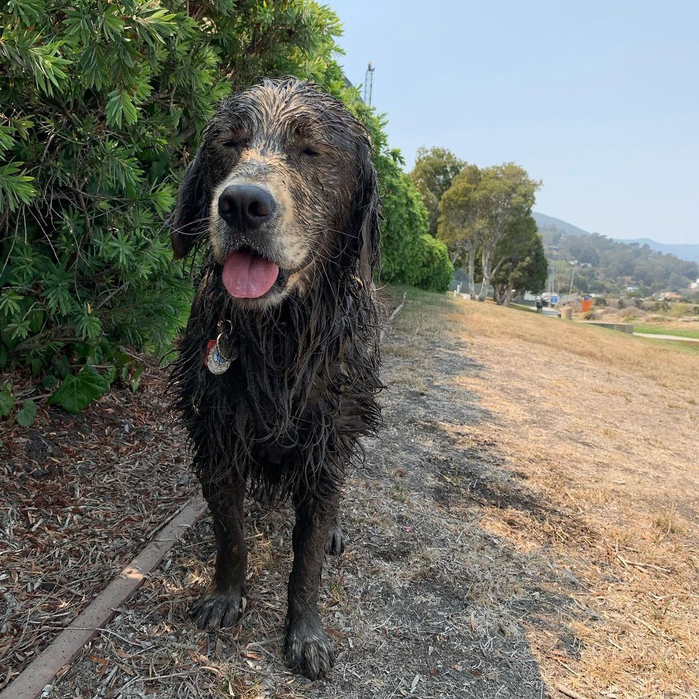

# Hello world

## About Me

Hello! I'm Henry, a UCSD transfer CS major.
### My Programming Journey
1. I first got exposed to programming with Scratch in my middle school STEM class, and I enjoyed it.
2. I also enjoyed taking the AP CS courses in high school.
3. Now I am here at UCSD as a CS major.  


**Languages I like**  
- Java
- Python
- C++

[Favorite language](https://github.com/hc225/user-page/blob/vscode-ui/README.md)

**Some code**  
```
public class HelloWorld {
    public static void main(String[] args) {
        System.out.println("Hello, world!");
    }
}
```

### Tasks
- [x] Graduate middle school
- [x] Graduate high school
- [ ] Graduate university

### Dogs  
> "Dog is man's best friend" - someone


*So, here's my Chocolate Lab.* 
  

Just kidding, he's a Golden Retreiver.  
[Pluto](photos/plutos.jpg)  


- [Back to Top](#hello-world)
- [Github page link](README.md) 
